# Interaura: AI Mock Interview & Career Accelerator

**Team:** AI Forge | **Event:** IITHackathon 2024

**Interaura** is an advanced AI-powered platform designed to bridge the gap between candidate preparation and industry expectations. By simulating real-world interview scenarios and providing objective, data-driven feedback, we transform interview anxiety into confidence.


## 🧠 The Problem: The "Black Box" of Hiring

Job seekers today navigate an opaque and high-pressure hiring landscape:

  * **Resume Uncertainty**: "Is my resume even getting past the ATS?" Candidates lack visibility into automated screening logic.
  * **Lack of Feedback**: Rejections rarely come with actionable insights, leaving candidates unaware of their specific weaknesses (e.g., "Was it my code or my communication?").
  * **Interview Anxiety**: Many candidates "freeze up" during technical questioning due to a lack of low-pressure practice environments.
  * **Generic Prep**: Traditional platforms offer generic question banks that don't adapt to specific roles or experience levels.

## 💡 The Solution: Data-Driven Preparation

Interaura transforms preparation into a science using three core pillars:

1.  **Smart Resume Analysis**: A hybrid parsing engine (Gemini AI + TF-IDF) that decodes ATS logic to score resumes against job descriptions.
2.  **Multi-Modal AI Mock Interviews**: Real-time simulations that analyze **Content** (what you say), **Speech** (how you say it), and **Visual Presence** (body language).
3.  **Personalized Growth**: Targeted learning roadmaps generated based on specific performance gaps.


## 🏗 Technical Architecture

Interaura utilizes a modern, event-driven architecture designed for high scalability and sub-2-second latency.

```mermaid
%%{init: {'theme': 'base', 'themeVariables': { 'primaryColor': '#0f172a', 'primaryTextColor': '#e2e8f0', 'primaryBorderColor': '#7e22ce', 'lineColor': '#a855f7', 'secondaryColor': '#1e293b', 'tertiaryColor': '#334155', 'background': '#020617', 'mainBkg': '#0f172a', 'secondBkg': '#1e293b', 'edgeLabelBackground':'#334155', 'clusterBkg': '#1e293b', 'clusterBorder': '#475569', 'fontSize': '14px'}}}%%

graph TB
    subgraph Client ["🌐 FRONTEND LAYER - React Ecosystem"]
        direction TB
        UI[React 18 + Vite<br/>⚡ Fast Refresh & HMR]
        Style[TailwindCSS + Framer Motion<br/>🎨 Glassmorphism & Animations]
        Charts[Recharts<br/>📊 Progress Visualization]
        WebRTC[WebRTC APIs<br/>🎥 Camera/Mic Capture]
        
        UI --> Style
        UI --> Charts
        UI --> WebRTC
    end

    subgraph Gateway ["🚪 API GATEWAY"]
        FastAPI[FastAPI<br/>⚡ Async Python Backend<br/>WebSocket Support]
    end

    subgraph AIServices ["🤖 AI PROCESSING LAYER"]
        direction LR
        
        subgraph Vision ["👁️ Computer Vision"]
            OpenCV[OpenCV<br/>Face Detection<br/>Posture Analysis<br/>Eye Contact Tracking]
        end
        
        subgraph Speech ["🎙️ Speech Processing"]
            Deepgram[Deepgram Nova-2<br/>Real-time STT<br/>Filler Detection<br/>WPM Calculation]
        end
        
        subgraph Intelligence ["🧠 Language Intelligence"]
            Groq[Groq Llama 3<br/>Ultra-low Latency<br/>Question Generation<br/>Answer Evaluation<br/>Content Analysis]
        end
    end

    subgraph DataLayer ["💾 DATA & AUTH LAYER"]
        direction TB
        Firebase[Firebase<br/>🔐 Authentication<br/>📁 Firestore DB<br/>☁️ Cloud Storage]
        Cache[Redis Cache<br/>⚡ Session State<br/>🎯 Hot Data]
    end

    subgraph Processing ["⚙️ BACKGROUND JOBS"]
        Celery[Celery Workers<br/>📄 Resume Parsing<br/>📊 Report Generation<br/>📧 Email Notifications]
        Queue[(Message Queue<br/>RabbitMQ/Redis)]
    end

    %% Data Flow Connections
    Client -->|HTTPS/WSS| Gateway
    Gateway -->|Video Stream| Vision
    Gateway -->|Audio Stream| Speech
    Gateway -->|Text Analysis| Intelligence
    
    Vision -->|Metrics JSON| Gateway
    Speech -->|Transcript + Stats| Gateway
    Intelligence -->|Evaluation + Questions| Gateway
    
    Gateway <-->|Auth & CRUD| DataLayer
    Gateway -->|Async Tasks| Processing
    Processing <-->|Job Results| DataLayer
    
    Gateway -->|Real-time Updates| Client

    %% Styling
    classDef frontend fill:#2563eb,stroke:#60a5fa,color:#fff,stroke-width:3px
    classDef backend fill:#7e22ce,stroke:#a855f7,color:#fff,stroke-width:3px
    classDef ai fill:#be123c,stroke:#f43f5e,color:#fff,stroke-width:3px
    classDef data fill:#059669,stroke:#34d399,color:#fff,stroke-width:3px
    classDef process fill:#ea580c,stroke:#fb923c,color:#fff,stroke-width:3px

    class UI,Style,Charts,WebRTC frontend
    class FastAPI backend
    class OpenCV,Deepgram,Groq ai
    class Firebase,Cache data
    class Celery,Queue process

    linkStyle default stroke:#a855f7,stroke-width:2px
```




### 🛠️ Stack Breakdown

**Frontend (Client)**

  * **React 18 & Vite**: Chosen for high performance and efficient state management.
  * **WebRTC & MediaRecorder API**: Captures high-quality audio and video directly in the browser without plugins.
  * **Tailwind CSS**: Utility-first styling for a responsive, consistent design system.
  * **Recharts**: Visualizes progress trends and score breakdowns.

**Backend (API Gateway)**

  * **FastAPI (Python)**: Selected for its native asynchronous support (async/await), crucial for handling simultaneous WebSocket connections for media streaming.
  * **WebSockets**: Enables bi-directional real-time communication between the user and the AI.

**AI Processing Layer**

  * **Logic & Reasoning**: **Groq (Llama 3.1 70B)** provides ultra-low latency question generation and content evaluation. OpenAI GPT-4o serves as a robust fallback.
  * **Speech Services**: **Deepgram Nova-2** handles Speech-to-Text (STT) with high accuracy, calculating WPM (Words Per Minute) and detecting filler words ("um", "uh").
  * **Computer Vision**: **OpenCV** analyzes video frames to track eye contact consistency, head pose, and movement stability.
  * **Resume Engine**: **Google Gemini 1.5 Flash** combined with scikit-learn (TF-IDF) performs deep semantic matching between resumes and job descriptions.

**Data & Security**

  * **Supabase (PostgreSQL)**: Manages user profiles, interview transcripts, and report data.
  * **Row Level Security (RLS)**: Ensures strict data isolation, allowing users to access only their own records.


## 🚀 Key Innovations & Features

**1. Multi-Modal Analysis**
Unlike text-only tools, Interaura evaluates the "whole candidate":

  * **Content Quality (40%)**: Technical accuracy, depth, and relevance of the answer.
  * **Visual Presence (30%)**: Eye contact consistency and professional posture.
  * **Speech Delivery (20%)**: Pacing (WPM) and confidence markers (hesitations).
  * **Communication Style (10%)**: Clarity, tone, and conciseness.

**2. Smart Resume Scoring**
We use a hybrid approach to mimic real ATS systems:

  * **Keyword Matching**: TF-IDF vectorization identifies missing hard skills.
  * **Semantic Analysis**: Gemini AI evaluates experience relevance and impact quantification.

**3. Real-Time Performance**

  * **Latency Optimization**: Frame sampling (processing every 5th frame) and async pipelines reduced video processing time from 30s to \~8s.
  * **Rate Limit Handling**: Custom request queuing with exponential backoff ensures stability even during high API load.


## 🗺️ Application Sitemap & Flow

The application guides users through a structured journey from onboarding to detailed feedback.


### Flow Breakdown

1.  **Onboarding**: Secure Email/Password auth via Supabase ensures account security.
2.  **Dashboard**: The central command center showing daily stats, recent scores, and quick actions.
3.  **Resume Parsing**: Users upload a PDF. Text is extracted and matched against role keywords to generate a **Match Score**.
4.  **Interview Session**:
      * **Questioning**: AI generates relevant Technical and Behavioral questions based on the resume.
      * **Recording**: Captures video (for UI feedback) and audio (for analysis).
      * **Analysis**: Video frames are checked for attention; audio is transcribed and analyzed for fillers; content is scored for relevance.
5.  **Feedback**: Comprehensive report card comparing "what you said" vs. "how you said it."


## ⚡ Getting Started

### Prerequisites

  * **Python**: 3.9+
  * **Node.js**: 18+
  * **FFMPEG**: Required for local audio processing (usually installed automatically by libraries, but system install recommended).

### Environment Setup

1.  **Clone the Repository**

    ```bash
    git clone https://github.com/your-repo/interaura.git
    cd interaura
    ```

2.  **Backend Setup**

    ```bash
    cd backend
    python -m venv venv
    # On Windows: venv\Scripts\activate
    source venv/bin/activate 
    pip install -r requirements.txt
    ```

3.  **Configure Environment Variables**
    Create a `.env` file in the `backend/` directory:

    ```env
    GROQ_API_KEY=your_groq_key
    DEEPGRAM_API_KEY=your_deepgram_key
    SUPABASE_URL=your_supabase_url
    SUPABASE_KEY=your_supabase_anon_key
    GEMINI_API_KEY=your_google_key
    ```

4.  **Frontend Setup**

    ```bash
    cd ../frontend
    npm install
    ```

5.  **Launch Application**

      * **Terminal 1 (Backend):**
        ```bash
        uvicorn backend.main:app --reload
        ```
      * **Terminal 2 (Frontend):**
        ```bash
        npm run dev
        ```


## 🔮 Future Roadmap

  * **Phase 1: Foundations**: Architecture setup, DB schema, API contracts (Completed).
  * **Phase 2: MVP**: Text-only interview validation and Auth (Completed).
  * **Phase 3: Real-Time Audio**: WebSockets integration for live STT/TTS (Current).
  * **Phase 4: Feedback Engine**: Asynchronous report generation and detailed UI (In Progress).
  * **Phase 5: Launch**: Production deployment, monitoring (Sentry), and public release.

-----

*Empowering candidates to interview with confidence.*
